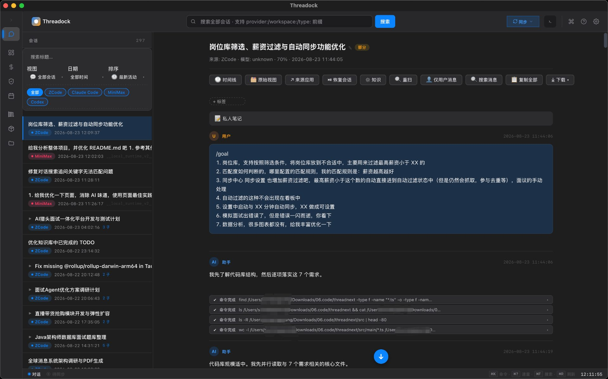
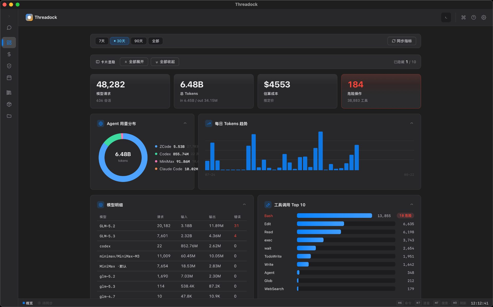
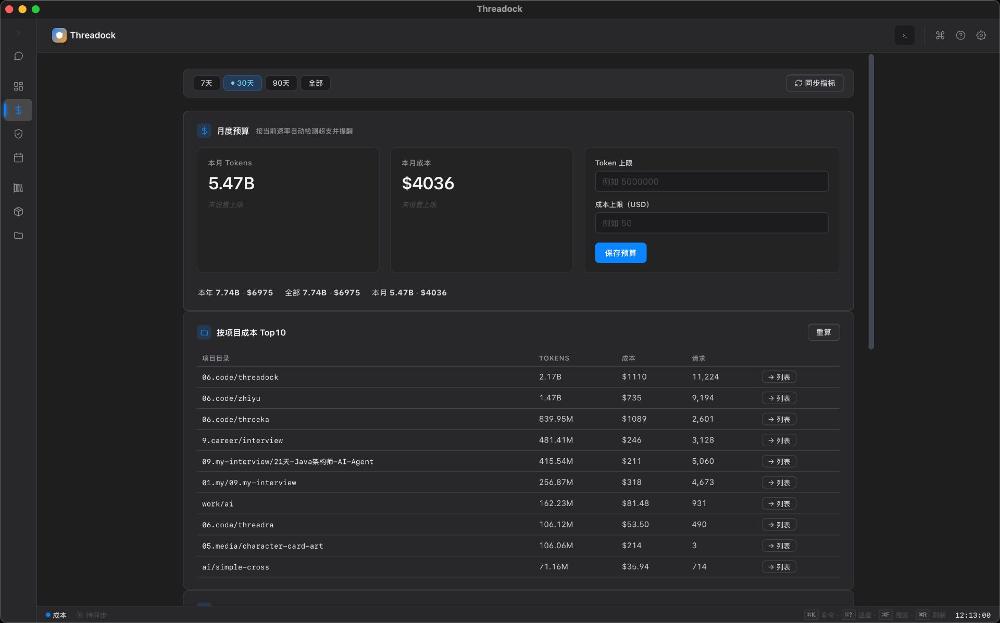
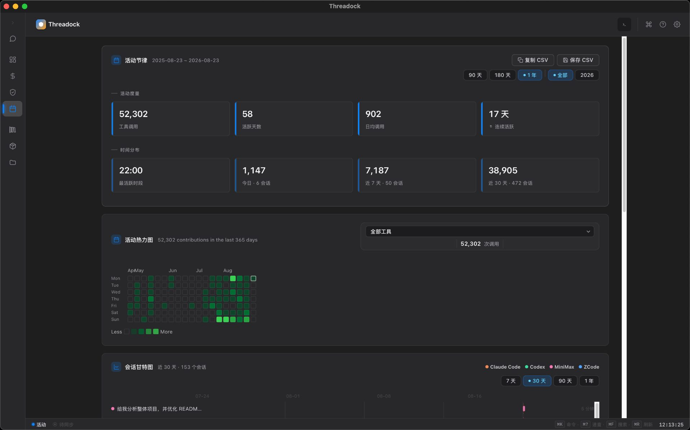
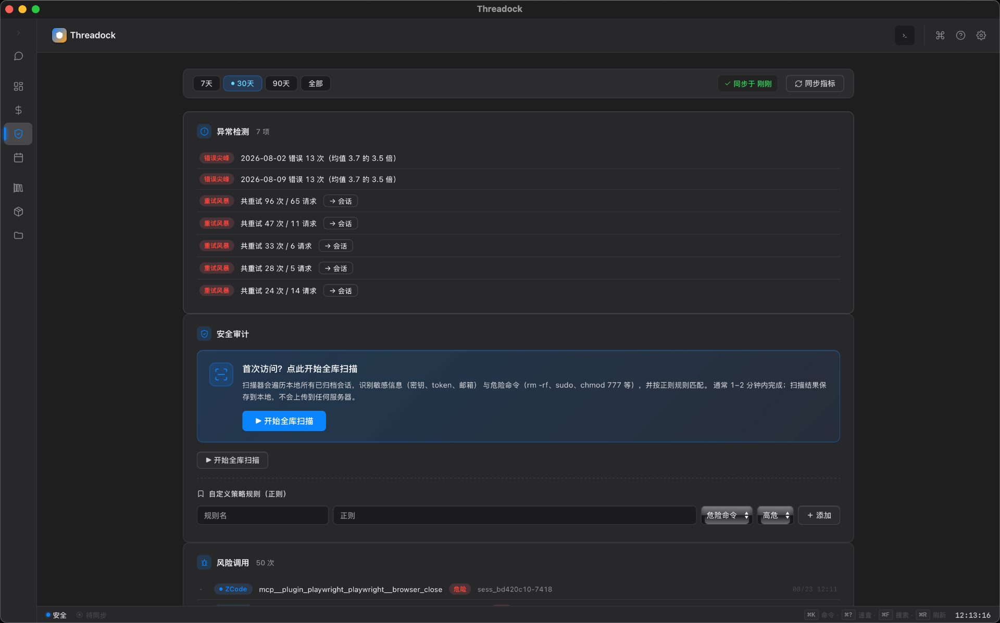
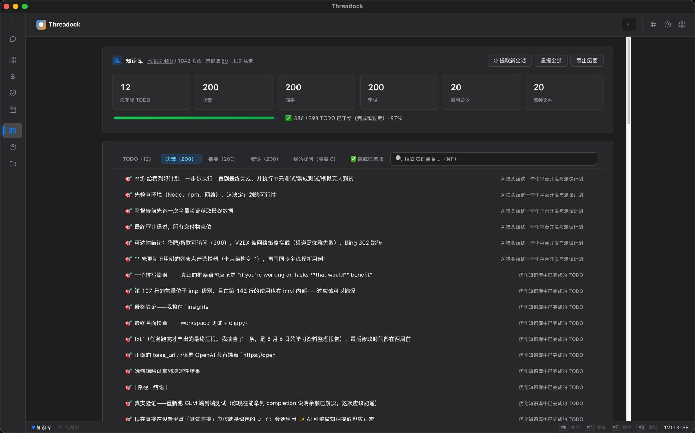
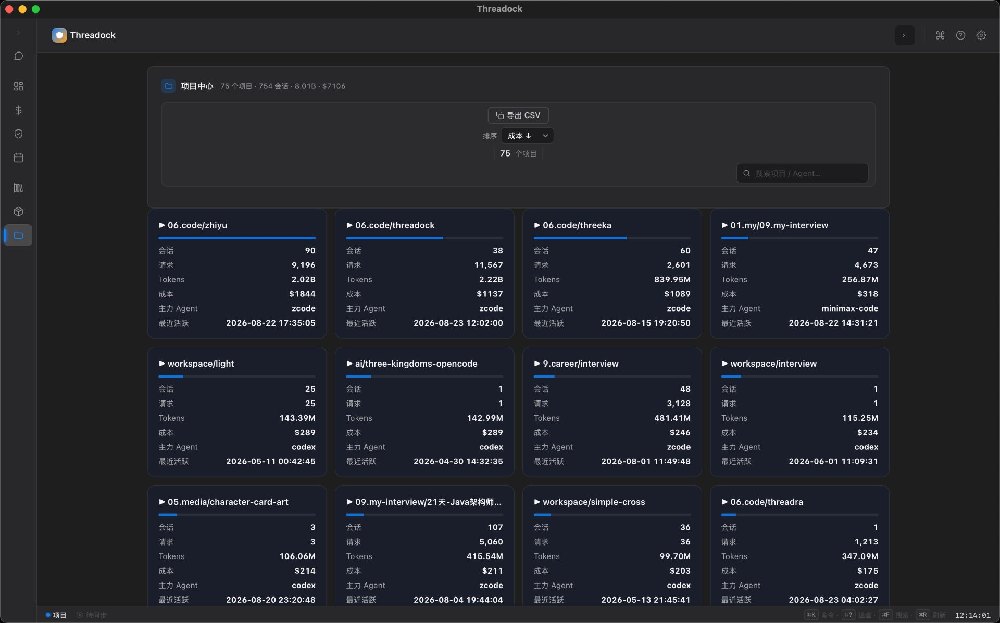
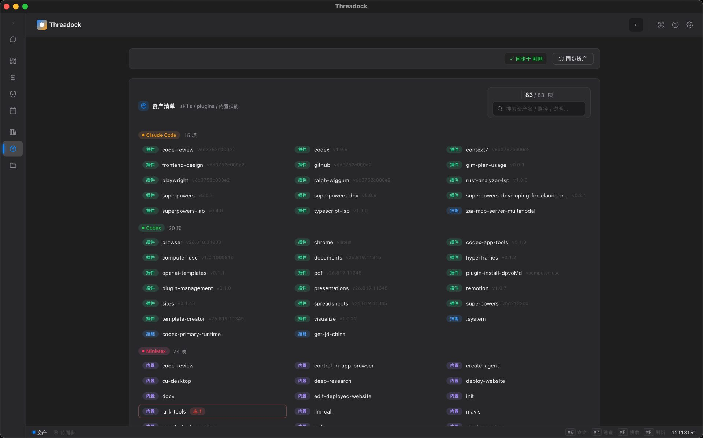
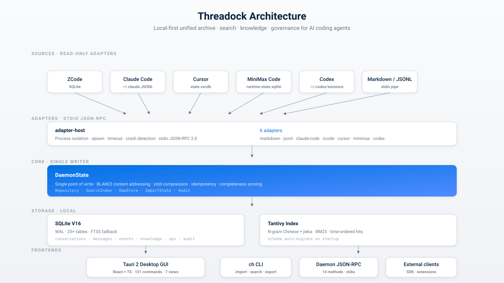

<div align="center">


# Threadock

**一个本地归档，收齐所有 AI 编程工具。可全文搜索、可治理、永远是你的。**

跨 AI IDE 的统一会话归档、检索、知识提取与治理平台——把 ZCode · Claude Code · Cursor ·
MiniMax Code · Codex · DeepSeek Harness 等工具里的会话、工具调用、命令、Diff、Artifact 统一收集、标准化、
全文检索、知识化,并对用量 / 成本 / 安全做持续治理。

[English](README.md) · [简体中文](README.zh-CN.md)

</div>

<div align="center">

[](CHANGELOG.md)
[](LICENSE-MIT)
[](https://www.rust-lang.org)
[](https://tauri.app)
[](https://react.dev)
[](#测试)
[](#安装)
[](docs/privacy.md)

</div>

<div align="center">

[**快速开始**](#快速开始) · [**功能特性**](#功能特性) · [**架构**](#架构) · [**用户指南**](docs/user-guide.md) · [**隐私声明**](docs/privacy.md) · [**更新日志**](CHANGELOG.md)

</div>

---

## 为什么做 Threadock

你大概率不只用一个 AI 编程工具。这里用 ZCode,那里用 Claude Code,Cursor 写前端,Codex
跑 shell 任务,MiniMax 处理长流程。每个工具各自留一份历史,各自的格式、各自的库、各自的规则。

Threadock **只读地**把这些历史收上来,标准化成一个统一模型,再给你:

- **一个搜索框,搜遍全部工具** —— 支持查询语法(`provider:`、`workspace:`、`type:`、
  `after:`、`before:`、`file:`、`model:`),中文友好(N-gram 分词,可选 jieba)
- **一层知识** —— 从每条会话里自动抽摘要、决策、TODO、错误、命令、文件六类;默认用
  高速规则引擎,可选 LLM 引擎(OpenAI 兼容端点,云端或本地 Ollama / LM Studio / llama.cpp)
- **一份治理** —— 按项目统计 Token 花费,看成本趋势与缓存命中率,扫描敏感信息与危险命令,
  自动跑保留策略与孤儿 blob GC
- **一个不打扰你的桌面客户端** —— Local-first,无账号、无遥测、AES 加密备份,密钥你自己管

## 截图

以下截图全部来自 **v1.3.0** 在真实语料上运行的结果——**48,282 次请求 · 6.48B tokens ·
$4,553 花费,跨 5 个 Agent、1,184 条会话**。支持明暗双主题,此处展示暗色版。

<table>
  <tr>
    <td colspan="2"></td>
  </tr>
  <tr>
    <td></td>
    <td></td>
  </tr>
  <tr>
    <td></td>
    <td></td>
  </tr>
  <tr>
    <td></td>
    <td></td>
  </tr>
  <tr>
    <td colspan="2"></td>
  </tr>
</table>

> 13 轮 UI/UX 打磨历程见 [docs/optimization-rounds/REPORT.md](docs/optimization-rounds/REPORT.md)。

## 架构

<p align="center">
  
</p>

三层架构,一个铁律:**第三方数据只读**。

- **Adapters** —— 七个来源(markdown、jsonl、claude-code、zcode、cursor、minimax、codex、deepseek-harness)
  跑在独立子进程里,通过 stdio JSON-RPC 通信。适配器崩了不会拖垮主进程;超时不会卡住 UI
- **Core(`DaemonState`)** —— 唯一的写者。BLAKE3 内容寻址、zstd 压缩、幂等去重、完整度
  评分、审计日志。SQLite V16(25+ 表) + Tantivy 索引(N-gram 中文 + 可选 jieba)
- **Frontends** —— Tauri 2 桌面(React + TS,101 个命令,7 个视图)、`ch` CLI、常驻 JSON-RPC
  Daemon(14 个方法)、公开 API 给外部客户端

## 功能特性

### 会话中枢

| | |
|---|---|
| 🔌 **7 个只读 Adapter** | ZCode · Claude Code · Cursor · MiniMax Code · Codex · DeepSeek Harness · Markdown/JSONL —— 进程隔离,崩溃安全 |
| 🗄️ **SQLite V16 + WAL** | 25+ 表、FTS5 兜底、启动自动迁移 schema |
| 🔍 **双引擎搜索** | Tantivy(N-gram + jieba 可选)主,FTS5 兜底;支持查询语法,按消息时间倒序 |
| 🧬 **统一标准化** | 6 来源 × 19 事件类型领域模型;BLAKE3 哈希、幂等、完整度评分 |
| 📦 **内容寻址 Raw Store** | 原始 payload 全部保留,可重复提取 / 审计 |
| 🏷️ **Workspace 自动合并** | 7 级优先级 + 置信度,支持手动覆盖 |
| ⭐ **收藏 / 标签 / 归档 / 软删 / 硬删** | 软删可恢复;硬删级联清理搜索索引与 Raw Store |
| 🔁 **增量同步** | `import_state` 新鲜度检测;10 分钟自动同步;重置后自动重算 |
| 💡 **知识提取** | 默认规则引擎;可选 LLM 引擎(OpenAI / DeepSeek / GLM / Ollama / LM Studio / llama.cpp);schema 版本化,运行历史可查 |
| 🔐 **加密备份 / 恢复** | XChaCha20-Poly1305 + Argon2id,主密钥不离盘 |
| 🧪 **相似会话推荐** | 有界候选集,适合回溯历史上下文 |
| 🧠 **保存搜索** | 跨会话持久化,一键复跑 |

### CodeAgentOps 治理

面向团队与重度用户的第二层视角:用量、成本、安全、自动化。

- **用量 / 成本采集** —— 跨 4 家 Agent 的请求级 usage
- **治理仪表盘** —— 成本、缓存命中、延迟 P50/P95 趋势
- **安全审计** —— 敏感信息 + 危险命令扫描,HTML 报告
- **策略 / 预算 / 定价模型** —— 超限告警,月末预测
- **资产盘点** —— 跨 Agent 的 skills / plugins
- **项目成本归因** + 缓存命中率分析
- **异常检测** —— 错误尖峰、重试风暴、上下文超限
- **Agent 健康评分** —— 0–100,按稳定性加权
- **Token 浪费检测** + 横向对比
- **周报自动生成** —— HTML,落到 `app_data/reports/`
- **数据生命周期** —— 存储看板、孤儿 blob GC、保留策略、索引重建
- **治理审计轨迹** —— 敏感操作全记录

### 桌面 GUI(7 视图)

`概览` · `会话`(时间线 + 批量操作)· `知识库`(跨会话 + 双引擎)· `活动`(GitHub 风格
热力图 + 会话甘特图)· `项目` · `治理`(成本 · 资产 · 安全 · 自动化)· `设置`。

- Apple 风格浅色 / 深色主题,4 档字号(macOS *Larger Text*)
- Command Palette、首次启动引导、启动更新日志
- 每会话私人笔记、⌘1–⌘8 侧栏快捷键、应用内底部终端 dock(⌘J)
- 搜索历史下拉(单条删除)、会话甘特图、列表横向滚动、消息内联本机图片预览

## 快速开始

### 桌面(开发模式)

```bash
git clone https://github.com/SunArthurX/threadock.git
cd threadock
cd apps/desktop
npm install
npx tauri dev          # dev 模式 Dock 同样显示真实应用图标
```

### 完整构建

```bash
# CLI + Daemon + Markdown Adapter
cargo build --release -p ch-cli -p ch-daemon -p ch-adapter-markdown

# Tauri 桌面应用
cd apps/desktop && npm install && npm run build
cd src-tauri && cargo build --release
```

### 安装包

推 `v*` tag → [Release 流水线](.github/workflows/release.yml) 自动构建并发布
**macOS**(dmg arm64 + x64)、**Windows**(nsis + msi)、**Linux**(appimage + deb) 三平台
Tauri 安装包 + 四平台 CLI 二进制 + SHA256SUMS。

[](https://github.com/SunArthurX/threadock/releases)

> 安装包**当前未签名**(证书待接入)。macOS 首次打开右键 → 打开(或
> `xattr -dr com.apple.quarantine <app>`);Windows SmartScreen 选「仍要运行」;下载后请
> 比对 SHA256SUMS。

### CLI 一览

```bash
CH=./target/release/ch

# 导入(自动识别格式)
$CH --db ./hub.db import docs/tauri-android.md --workspace my-app

# 从真实 IDE 数据导入(只读)
$CH --db ./hub.db import-from claude-code list
$CH --db ./hub.db import-from zcode <session-id>

# 搜索(支持查询语法)
$CH --db ./hub.db search 后台任务
$CH --db ./hub.db search-tantivy WorkManager
$CH --db ./hub.db search 'provider:codex 错误处理'
$CH --db ./hub.db search 'workspace:my-app after:2026-01-01 status:favorite tauri'

# 知识提取
$CH --db ./hub.db knowledge <id>            # 提取并显示
$CH --db ./hub.db knowledge <id> --save     # 提取并持久化(版本化)
$CH --db ./hub.db knowledge <id> --show     # 显示已保存的
$CH --db ./hub.db similar <id>              # 相似会话

# 治理 / 备份
$CH --db ./hub.db export markdown <id> out.md
$CH --db ./hub.db redaction-rule add my-key 'sk-foo-[0-9]+'
CH_BACKUP_PASSWORD="..." $CH --db ./hub.db backup hub.chbak

# 启动 Daemon(stdio JSON-RPC,14 个方法)
$CH --db ./data daemon
```

### Daemon JSON-RPC

```bash
echo '{"jsonrpc":"2.0","id":1,"method":"system.getInfo","params":{}}' | $CH daemon
echo '{"jsonrpc":"2.0","id":2,"method":"search.query","params":{"query":"tauri","engine":"tantivy"}}' | $CH daemon
```

方法清单:`system.getInfo` · `workspace.list` · `conversation.list` · `conversation.get` ·
`conversation.delete` · `conversation.restore` · `conversation.similar` · `message.list` ·
`event.list` · `search.query` · `knowledge.extract` · `knowledge.save` · `knowledge.get` ·
`provider.sync`。完整定义见 [docs/api.md](docs/api.md)。

## 项目结构

```
threadock/
├── crates/
│   ├── domain/              统一领域模型(6 来源 × 19 事件类型)
│   ├── storage/             SQLite V16 + Migration + FTS5 + 治理表
│   ├── raw-store/           内容寻址原始数据(BLAKE3 + zstd)
│   ├── search/              Tantivy(N-gram 中文 + jieba 可选)
│   ├── identity-resolver/   Workspace 自动合并(7 级优先级)
│   ├── normalization/       标准化流水线(哈希 + 幂等 + 完整度)
│   ├── export/              Markdown / JSON 导出 + 脱敏
│   ├── backup/              XChaCha20-Poly1305 + Argon2id
│   ├── knowledge/           规则 + LLM 双引擎(版本化)
│   ├── llm/                 LLM 客户端 + AEAD 密钥保险库
│   ├── adapter-sdk/         Adapter trait + stdio JSON-RPC 协议
│   ├── adapter-host/        进程隔离(spawn / 超时 / 崩溃检测)
│   ├── adapter-markdown/    Markdown Adapter(独立二进制)
│   ├── adapter-jsonl/       JSONL Adapter
│   ├── adapter-claude-code/ Claude Code Adapter
│   ├── adapter-zcode/       ZCode Adapter(SQLite 直读)
│   ├── adapter-cursor/      Cursor Adapter(state.vscdb)
│   ├── adapter-minimax/     MiniMax Code Adapter
│   ├── adapter-codex/       Codex Adapter
│   ├── adapter-deepseek-harness/ DeepSeek Harness (dsh) Adapter
│   ├── ops-metrics/         用量 / 成本 / 健康度指标
│   ├── audit/               安全审计(敏感信息 + 危险命令)
│   ├── benchmarks/          性能基准(吞吐 / 搜索延迟 / 冷启动)
│   ├── daemon/              常驻服务(JSON-RPC over stdio)
│   └── cli/                 `ch` 命令行
├── apps/desktop/            Tauri 2 桌面(React + TS)
│   ├── src/                 7 视图 · 101 命令 · 90+ SVG 图标
│   └── src-tauri/           Rust 后端
├── docs/                    方案、用户指南、隐私、API、基准
├── fixtures/                脱敏样本 + Adapter golden tests
└── .github/workflows/       CI(3 OS × lint × test)· CodeQL · Release
```

## 开发

### 提交前预检

```bash
scripts/precheck.sh --install-hooks   # 一次性:pre-commit=lint 档,pre-push=test 档
scripts/precheck.sh                   # 手动跑:lint 档(fmt×2 + clippy×2 + tsc + eslint)
scripts/precheck.sh test              # lint + 全部测试 + 构建(= CI)
scripts/precheck.sh all               # 再加 cargo audit + MSRV 1.88 check
```

脚本逐条镜像 `.github/workflows/ci.yml`。`clippy` 带 **CI 同款旗标**
(`-W clippy::pedantic -D warnings`)——本地裸 `cargo clippy` 不带旗标会漏掉 pedantic 违规,
出现"本地绿、CI 红"。紧急跳过:`git commit --no-verify`。

### 测试

```bash
cargo test --workspace                                          # Rust 核心
cargo test --manifest-path apps/desktop/src-tauri/Cargo.toml   # Tauri 命令
cd apps/desktop && npm test                                     # React + TS
cargo clippy --workspace --all-targets                          # pedantic 级 0 warning
cargo test -p ch-search --features jieba                        # jieba 分词器
cargo test --release -p ch-benchmarks --test perf -- --ignored --nocapture
cargo test --release -p ch-benchmarks --test perf large_scale -- --ignored --nocapture
```

| | |
|---|---|
| **Gate 1** | 10 万会话 / 50 万消息 FTS5 搜索 P95 = **50.9 ms**(红线 300 ms)——见 [docs/benchmark-report-v1.0.0.md](docs/benchmark-report-v1.0.0.md) |
| **Workspace 合并准确率** | 11 例标注样本 = 100%(错误 AutoMerge = 0) |
| **ESLint** | 0 error / 0 warning |
| **供应链 advisory** | 2 已修,1 个上游 blocked(RUSTSEC-2026-0253,等 tantivy 升级,CI 已容忍) |

## 关键设计决策

| 决策 | 状态 | 原因 |
|---|---|---|
| Local-first | ✅ | 你的会话历史留在你自己的电脑;无账号、无遥测、不上传 |
| SQLite WAL | ✅(V16) | 单文件、易备份、负载可预测 |
| Tauri 2 桌面 | ✅ | 原生窗口 + WebView;一个 Rust 二进制内嵌 Daemon |
| Rust 核心 | ✅(MSRV 1.88) | 内存安全 + 零成本 FFI;pedantic clippy 作为质量基线 |
| Tantivy 搜索 | ✅(N-gram + jieba) | N-gram 默认零外部依赖;jieba 可选用作中文召回增强 |
| Adapter 进程隔离 | ✅ | IDE Adapter 只读,且作为独立进程跑——一个 buggy adapter 拖不垮主进程 |
| Raw + Normalized 双存储 | ✅ | 原始 payload 全部保留(BLAKE3 寻址),可重复提取;标准化形式用于搜索 |
| 第三方数据只读 | ✅ | 铁律。从不写回 `~/.claude`、`state.vscdb` 等任何 IDE 源库 |

完整决策背景:[docs/conversation-hub-execution-plan.md §1.3](docs/conversation-hub-execution-plan.md)。

## 文档

- [用户指南](docs/user-guide.md) —— 安装、七个视图、同步、搜索、知识、备份
- [隐私声明](docs/privacy.md) —— 读什么、存什么、**不**做什么
- [API 参考](docs/api.md) —— 自动生成的 Tauri 命令面 + Daemon JSON-RPC 方法
- [性能基准报告](docs/benchmark-report-v1.0.0.md) —— Gate 1 大规模结果
- [总体方案](docs/ai-ide-conversation-hub-enterprise-plan.md) · [执行计划](docs/conversation-hub-execution-plan.md) · [治理计划](docs/codeagent-ops-plan.md)
- [UI 优化报告](docs/optimization-rounds/REPORT.md) —— 13 轮 × 每轮 30+ 改动
- [更新日志](CHANGELOG.md)

## 路线图

- [ ] OpenCode Adapter(第 6 → 7 来源)
- [ ] Daemon UDS / Named Pipe IPC + 本地认证 Token(当前仅 stdio)
- [ ] Adapter Host 资源配额(内存 / CPU / 文件白名单 / 禁网)
- [ ] Tauri Updater 自动更新 + 安装包签名 / 公证
- [ ] Android 浏览端(Phase 4 PoC)
- [ ] 企业能力:SSO / RBAC / KMS / 加密同步(Phase 5)

## 贡献

Issue 和 PR 欢迎。在开之前:

1. 读 [docs/conversation-hub-execution-plan.md](docs/conversation-hub-execution-plan.md) ——
   「不可妥协关键决策」小节解释为什么是这样。
2. 跑 `scripts/precheck.sh test` —— 跟 CI 同款命令。
3. 如果改动动了公开 API(Tauri 命令 / CLI 子命令 / JSON-RPC 方法),请同步更新
   `docs/` 下的相关文档。

较大改动请先开 issue 讨论方向。维护者只有一个人全职,review 请耐心等待。

## License

双重许可,任选其一:

- [MIT](LICENSE-MIT)
- [Apache 2.0](LICENSE-APACHE)

## 致谢

- [Tantivy](https://github.com/quickwit-oss/tantivy) —— 搜索引擎
- [Tauri](https://tauri.app) —— 桌面壳
- [SQLite](https://sqlite.org) —— 存储层
- [React](https://react.dev)、[Vite](https://vitejs.dev)、[Vitest](https://vitest.dev) —— 前端
- [xterm.js](https://xtermjs.org) —— 应用内终端
- ZCode · Claude Code · Cursor · MiniMax Code · Codex · DeepSeek Harness 背后的团队

---

<sub align="center">由 <a href="https://github.com/SunArthurX">SunArthurX</a> 维护 · 2026</sub>
