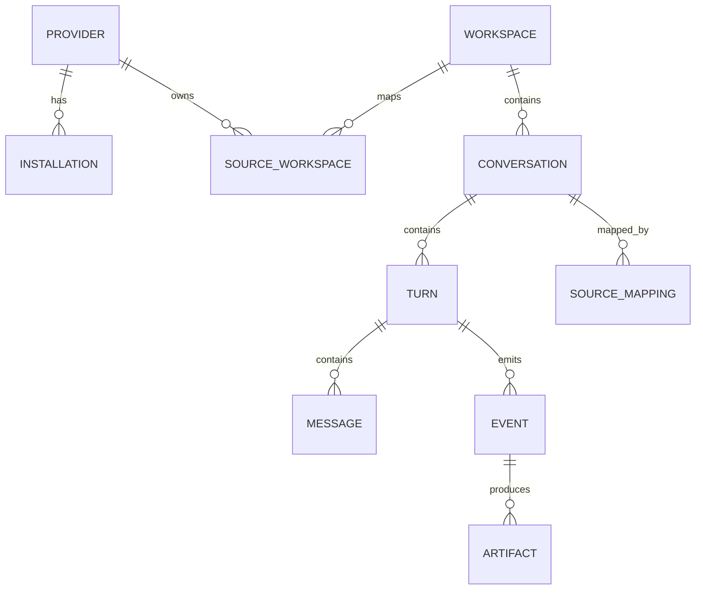
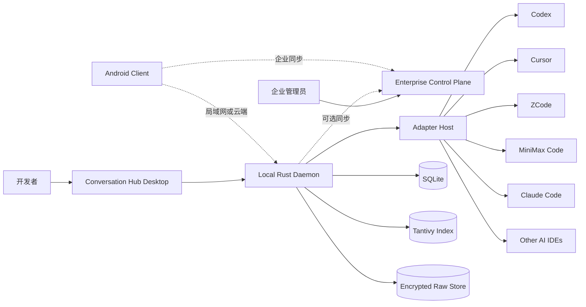
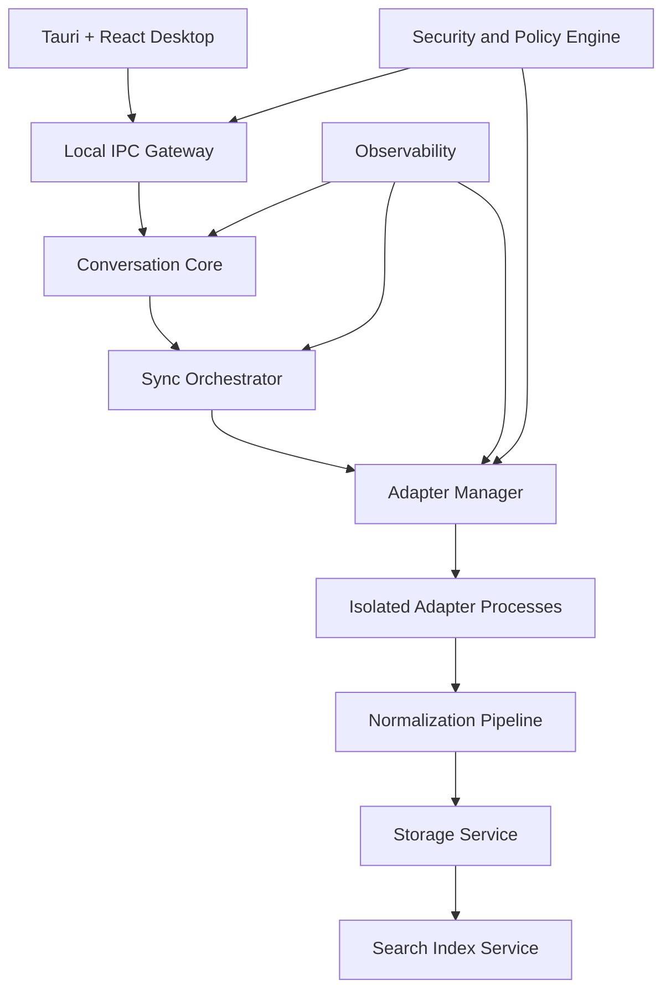
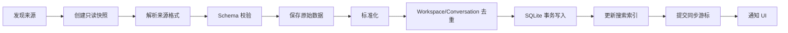
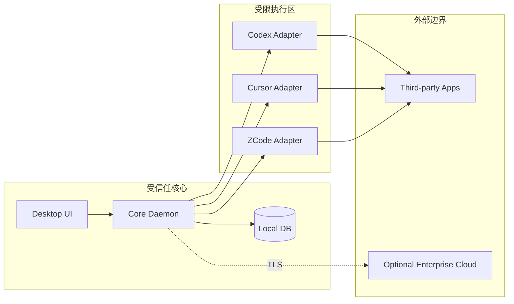
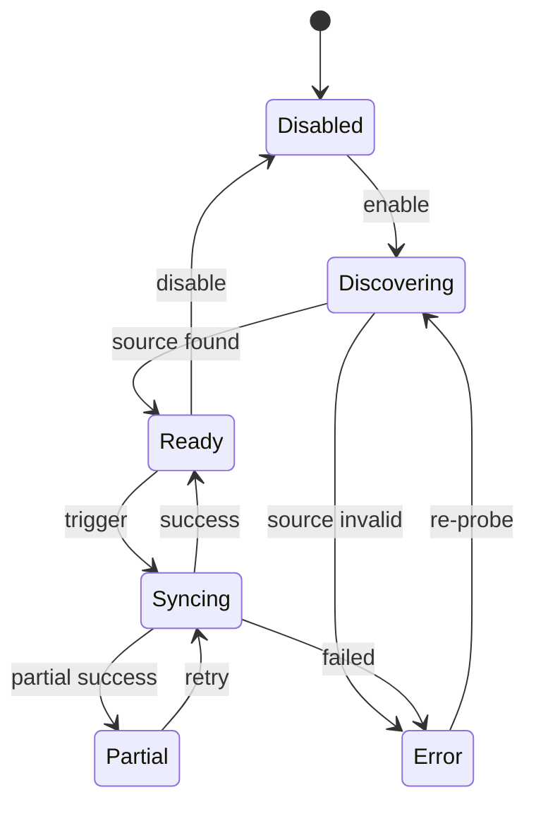
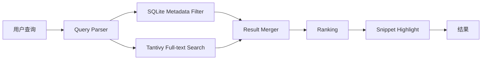
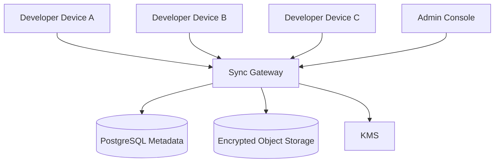

# AI IDE Conversation Hub 企业级实施方案

> **文档版本**：v1.0  
> **编制日期**：2026-08-02  
> **项目代号**：Conversation Hub  
> **目标产品**：统一收集、归档、检索和管理 Codex、Cursor、ZCode、MiniMax Code、Claude Code、OpenCode 等 AI 编程工具中的 Project、Conversation、Task、Message、Tool Call、Command、Diff 与 Artifact。  
> **推荐路线**：Local-first 桌面产品，企业能力按可选控制平面逐步演进。  
> **推荐技术栈**：Tauri 2 + React + TypeScript + Rust Daemon + SQLite + Tantivy + 版本化 Adapter。

---

## 目录

1. [执行摘要](#1-执行摘要)
2. [项目背景与范围](#2-项目背景与范围)
3. [产品定位与核心价值](#3-产品定位与核心价值)
4. [术语和统一领域模型](#4-术语和统一领域模型)
5. [目标用户与核心场景](#5-目标用户与核心场景)
6. [功能需求](#6-功能需求)
7. [非功能需求](#7-非功能需求)
8. [总体架构](#8-总体架构)
9. [技术选型](#9-技术选型)
10. [Adapter 接入体系](#10-adapter-接入体系)
11. [数据采集与同步设计](#11-数据采集与同步设计)
12. [数据模型与存储设计](#12-数据模型与存储设计)
13. [检索与知识化能力](#13-检索与知识化能力)
14. [安全、隐私与合规](#14-安全隐私与合规)
15. [企业部署模式](#15-企业部署模式)
16. [接口与协议设计](#16-接口与协议设计)
17. [桌面端产品设计](#17-桌面端产品设计)
18. [Android 与多端演进](#18-android-与多端演进)
19. [可观测性与 SRE](#19-可观测性与-sre)
20. [测试与质量体系](#20-测试与质量体系)
21. [CI/CD 与发布体系](#21-cicd-与发布体系)
22. [项目组织与代码结构](#22-项目组织与代码结构)
23. [实施路线图](#23-实施路线图)
24. [Epic、用户故事与验收标准](#24-epic用户故事与验收标准)
25. [团队配置与职责](#25-团队配置与职责)
26. [风险清单与缓解方案](#26-风险清单与缓解方案)
27. [里程碑与项目门禁](#27-里程碑与项目门禁)
28. [上线检查清单](#28-上线检查清单)
29. [首个 30 天执行计划](#29-首个-30-天执行计划)
30. [最终交付物](#30-最终交付物)
31. [参考资料](#31-参考资料)

---

# 1. 执行摘要

## 1.1 产品定义

Conversation Hub 不是新的 IDE，也不是单纯的代码项目启动器，而是：

> **跨 AI IDE 的统一会话、任务和知识管理平台。**

产品以各 AI 编程工具中的“Project/Workspace”为一级组织单元，将其下的 Conversation、Task、Message、Tool Call、Command、File Change、Diff、Approval 和 Artifact 标准化后统一保存、检索和展示。

典型结构：

```text
Unified Workspace：simple-cross
├── Codex
│   ├── 每小时优化 simple-cross
│   └── 分析三端架构
├── Cursor
│   ├── 修复 TypeScript 类型
│   └── 重构窗口管理
├── ZCode
│   └── Android 端适配
└── MiniMax Code
    └── 自动生成集成测试
```

## 1.2 推荐方案

| 层级 | 推荐技术 |
|---|---|
| 桌面客户端 | Tauri 2 + React + TypeScript |
| 本地后台服务 | Rust + Tokio |
| 本地 IPC | Unix Domain Socket / Windows Named Pipe + JSON-RPC 2.0 |
| 主数据存储 | SQLite，WAL 模式 |
| 全文检索 | Tantivy；SQLite FTS5 作为 MVP/降级方案 |
| 原始数据归档 | Content-addressed JSON/JSONL + Zstandard 压缩 |
| Adapter 扩展 | 独立进程 + JSON-RPC over stdio |
| 本地密钥 | macOS Keychain / Windows Credential Manager / Linux Secret Service |
| 可选云端 | API Gateway + PostgreSQL + Object Storage + KMS |
| 移动端 | Tauri 2 Mobile + React，连接桌面 Daemon 或企业同步服务 |

## 1.3 建设策略

采用三段式推进：

1. **本地优先 MVP**：Codex、Cursor、Claude Code、Markdown/JSON 导入。
2. **Adapter 平台化**：增加 ZCode、MiniMax Code、OpenCode，并建立兼容测试体系。
3. **企业化**：策略管理、审计、SSO、团队空间、可选加密同步、数据保留与合规能力。

## 1.4 时间与资源建议

- **MVP**：12 周。
- **Private Beta**：20 周。
- **企业 GA**：28 周。
- **推荐团队规模**：8～10 人。
- **精简团队规模**：4～5 人，预计 9～12 个月完成企业 GA。

---

# 2. 项目背景与范围

## 2.1 背景

开发人员同时使用多种 AI 编程工具后，会出现以下问题：

- 对话分散在不同应用、不同 Project 和不同设备。
- 很难找到数周或数月前的技术决策。
- 相同代码仓库在多个工具中产生重复任务。
- 工具升级、清理缓存或卸载后，历史记录可能丢失。
- AI 执行过程中的命令、Diff、文件修改和审批记录难以长期追溯。
- 个人经验无法沉淀为可检索的团队知识。
- 企业无法统一实施保留策略、审计和敏感信息治理。

## 2.2 项目范围

### 纳入范围

- 发现本机已安装的 AI 编程工具。
- 导入 Project、Workspace、Conversation、Task、Message 和事件。
- 统一不同来源的项目分组。
- 增量同步和版本兼容。
- 全文搜索、筛选、收藏、标签、归档和导出。
- 统一展示工具调用、命令、Diff、文件变更和审批。
- 生成摘要、技术决策、TODO 和失败原因。
- 一键返回来源应用或恢复来源会话。
- 本地优先的数据保护。
- 企业策略、审计和可选团队同步。

### 暂不纳入第一版

- 完整替代 Codex、Cursor、ZCode 等工具。
- 直接修改第三方工具的私有数据库。
- 绕过第三方登录、授权、加密或访问控制。
- 抓取用户无权访问的远程历史。
- 第一版提供完整的团队协同编辑。
- 第一版执行任意 Agent 任务。
- 第一版内置完整 IDE、Terminal 或 Debugger。

## 2.3 设计边界

1. Conversation Hub 的数据库是统一视图的主数据。
2. 第三方应用数据是来源数据，不是稳定 API。
3. 所有第三方数据读取默认只读。
4. 原始数据和标准化数据同时保留。
5. 任何无法稳定解析的来源必须提供手动导入降级路径。
6. 企业版云端不是本地版运行的前置依赖。

---

# 3. 产品定位与核心价值

## 3.1 核心价值

### 对个人开发者

- 一个入口搜索所有 AI 编程历史。
- 快速定位过去的报错、修复方法和架构决策。
- 避免在不同工具中重复解释项目背景。
- 将零散对话沉淀为个人技术知识库。
- 备份和导出重要会话。

### 对技术团队

- 形成项目级 AI 决策记录。
- 复用高质量提示词、处理流程和解决方案。
- 汇总失败模式、工具使用情况和工程经验。
- 支持团队知识迁移和新人 onboarding。

### 对企业

- 建立 AI Coding 使用的可见性和审计能力。
- 统一数据分类、保留、删除和导出策略。
- 管控敏感数据进入外部模型的风险。
- 支持合规检查、法律保留和安全事件调查。

## 3.2 产品原则

- **Local-first**：默认数据留在本机。
- **Read-only integration**：第三方来源默认只读。
- **Lossless ingestion**：保留来源原始结构。
- **Rebuildable index**：搜索索引可由主数据重建。
- **Provider-neutral**：内部模型不绑定任何一家产品。
- **Graceful degradation**：Adapter 失效不影响主应用。
- **Explicit consent**：每个数据源单独授权。
- **Enterprise optionality**：企业能力可选，不破坏个人版简洁性。

---

# 4. 术语和统一领域模型

## 4.1 核心术语

| 统一术语 | 含义 |
|---|---|
| Provider | 来源产品，如 Codex、Cursor、ZCode |
| Installation | 某台设备上的一个来源应用安装实例 |
| Workspace | 截图中的 Project，通常关联一个目录或 Git 仓库 |
| Conversation | Workspace 下的一条对话或 Agent 任务 |
| Turn | 一次用户输入及其引发的完整执行 |
| Message | 用户、模型或系统消息 |
| Event | Tool Call、Command、Diff、Approval 等执行事件 |
| Artifact | 文件、报告、补丁、图片、日志等产物 |
| Source Mapping | 统一对象与来源对象 ID 的映射 |
| Adapter | 将某来源数据转换为统一模型的适配器 |
| Raw Payload | 来源应用原始数据 |
| Normalized Projection | 统一展示和检索使用的数据 |

## 4.2 领域关系



## 4.3 Workspace 合并规则

同一代码项目可能在多个来源中使用不同名称，因此按以下优先级合并：

1. 用户手动绑定。
2. 统一 Project Manifest ID。
3. 规范化 Git Remote URL。
4. Git Common Directory。
5. 规范化绝对路径。
6. 文件系统对象 ID。
7. 名称相似度，仅作为低置信度候选。

任何自动合并都必须记录：

```text
match_method
match_confidence
matched_at
matched_by
manual_override
```

---

# 5. 目标用户与核心场景

## 5.1 用户角色

### 个人开发者

同时使用 2～5 种 AI 编程工具，关注历史搜索、备份和知识沉淀。

### 技术负责人

关注项目级 AI 使用记录、架构决策、错误模式和团队复用。

### 企业管理员

关注组织策略、数据留存、权限、审计、SSO 和合规。

### 安全与法务人员

关注敏感信息、数据流向、删除证明、法律保留和事件调查。

## 5.2 核心场景

### 场景 A：跨工具搜索

用户搜索：

> 之前在哪个 Agent 里讨论过 Tauri Android 后台任务？

系统返回不同来源中的相关 Conversation，并显示匹配片段、来源、Project 和时间。

### 场景 B：统一 Project

系统把 Codex、Cursor、ZCode 和 MiniMax 中的 `simple-cross` 自动归并到一个 Workspace。

### 场景 C：回溯修改过程

用户打开一条 Conversation，查看：

- 用户原始指令。
- Agent 回复。
- 执行过的命令。
- 修改过的文件。
- Diff。
- 审批记录。
- 最终状态和失败原因。

### 场景 D：知识提取

系统自动提取：

- 架构决策。
- TODO。
- 关键命令。
- 错误和解决方案。
- 涉及文件。
- 后续建议。

### 场景 E：企业审计

管理员查询：

- 某项目是否向外部模型发送过敏感文件名。
- 某时间段执行过哪些高风险命令。
- 某用户导出了哪些会话。
- 某数据是否已按保留策略删除。

---

# 6. 功能需求

## 6.1 数据源管理

- 自动发现已安装的 AI 编程工具。
- 展示来源版本、路径和 Adapter 状态。
- 每个来源独立启用、禁用和重新授权。
- 支持自动同步、手动同步和定时同步。
- 展示最近同步时间、同步量和错误。
- 支持 Adapter 兼容性诊断。
- 支持来源数据库路径手动配置。
- 支持导入 Markdown、JSON、JSONL 和 ZIP。

## 6.2 Conversation 采集

必须支持采集以下数据：

- 标题。
- Project/Workspace。
- 来源。
- 创建和更新时间。
- 模型名称。
- 用户消息。
- 模型消息。
- 工具调用。
- 命令。
- 文件操作。
- Diff。
- 审批。
- 执行耗时。
- Token/Usage，来源可提供时采集。
- 运行状态。
- 原始来源 ID。
- 来源版本和 Schema 版本。

## 6.3 Workspace 管理

- 自动合并相同 Workspace。
- 手动合并、拆分和重命名。
- 设置别名、标签、收藏和归档。
- 显示关联来源和 Conversation 数量。
- 显示本地路径、Git Remote 和分支信息。
- 保留原始来源名称。
- 支持多个 Worktree。

## 6.4 Conversation 浏览

- 按时间、来源、Workspace、状态和标签筛选。
- 显示 Message、Command、Tool Call、Diff 和 Artifact。
- 折叠低价值事件。
- 原始视图与统一视图切换。
- 复制、导出、收藏和添加备注。
- 一键打开来源应用。
- 来源支持时恢复原会话。
- 显示导入完整度和字段缺失。

## 6.5 搜索

- 标题搜索。
- 消息全文搜索。
- 命令搜索。
- 文件名搜索。
- Diff 搜索。
- 按来源、模型、Workspace、时间和状态过滤。
- 中英文混合搜索。
- 搜索结果高亮。
- 支持保存搜索条件。
- 支持自然语言语义检索，作为第二阶段能力。

## 6.6 导出与备份

- 单条 Conversation 导出 Markdown。
- Workspace 批量导出。
- 原始 JSON/JSONL 导出。
- 可选择是否包含命令、Diff 和 Artifact。
- 导出前敏感信息扫描和脱敏。
- 本地加密备份。
- 导入已有备份。
- 数据可移植性验证。

## 6.7 知识化能力

- 自动摘要。
- 技术决策提取。
- TODO 提取。
- 错误与解决方案提取。
- 关键命令提取。
- 相关 Conversation 推荐。
- 重复问题聚类。
- 可人工编辑和确认提取结果。
- AI 生成内容与原始数据严格区分。

## 6.8 企业管理

- SSO/OIDC。
- RBAC。
- 组织策略。
- Adapter 白名单。
- 数据保留策略。
- 导出策略。
- 敏感目录和文件规则。
- 审计日志。
- 法律保留。
- 远程配置下发。
- 版本最低要求。
- 可选团队同步。

---

# 7. 非功能需求

## 7.1 设计容量

企业 GA 的单设备设计容量：

| 指标 | 目标 |
|---|---:|
| Workspace | 10,000 |
| Conversation | 100,000 |
| Message | 5,000,000 |
| Event | 20,000,000 |
| 原始归档 | 20 GB |
| 单次导入 | 500,000 条 Message |
| Adapter 数量 | 20+ |

## 7.2 性能目标

| 场景 | 目标 |
|---|---|
| 冷启动 P95 | 小于 2.5 秒 |
| 常用页面切换 P95 | 小于 150 毫秒 |
| 100k Conversation 搜索 P95 | 小于 300 毫秒 |
| Conversation 详情打开 P95 | 小于 500 毫秒 |
| 增量同步延迟 | 小于 60 秒 |
| 本地导入吞吐 | 大于 500 Message/秒 |
| 后台空闲 CPU | 小于 1% |
| 后台空闲内存 | 小于 150 MB |

## 7.3 可靠性目标

- 导入过程幂等。
- Adapter 崩溃不影响主进程。
- 主数据库事务性写入。
- 搜索索引可完全重建。
- 原始数据写入后再提交同步游标。
- 同步中断可恢复。
- 数据库自动备份和完整性检查。
- 升级失败可回滚。
- 数据迁移必须支持前向恢复。

## 7.4 可维护性

- Adapter 与核心解耦。
- 所有协议有版本号。
- 所有数据库变更通过 Migration。
- 每个 Adapter 有 Golden Fixture。
- 所有关键决策通过 ADR 记录。
- 依赖升级有自动化兼容测试。
- 不在 UI 中实现数据解析逻辑。

---

# 8. 总体架构

## 8.1 系统上下文



## 8.2 本地组件架构



## 8.3 数据处理流水线



## 8.4 信任边界



---

# 9. 技术选型

## 9.1 桌面框架：Tauri 2

选择理由：

- 产品是对话管理中心，不是重型 IDE。
- Rust 适合本地数据库、文件和进程处理。
- 常驻资源占用低。
- Tauri Capability 可限制 WebView 可调用的系统能力。
- 支持签名更新。
- 后续可复用部分代码到 Android。

不选择 Electron 作为主框架的原因：

- 不需要完整 Chromium IDE 运行时。
- 安装包和常驻内存更高。
- 本项目的主要复杂度在采集、标准化和检索，而不是编辑器渲染。

## 9.2 前端

```text
React
TypeScript
Vite
TanStack Query
Zustand
React Virtual
React Router
Markdown Renderer
Diff Viewer
```

前端只负责：

- 展示。
- 用户交互。
- 查询状态。
- 调用业务 RPC。

前端不得：

- 直接访问第三方数据库。
- 直接执行任意 SQL。
- 直接读取用户主目录。
- 保存长期密钥。
- 承担 Adapter 解析。

## 9.3 Rust Daemon

推荐依赖：

```text
tokio
serde / serde_json
axum
sqlx 或 rusqlite
tracing
notify
uuid
time
zstd
blake3
jsonschema
thiserror
anyhow
```

Daemon 负责：

- 生命周期管理。
- Adapter 调度。
- 同步。
- 数据标准化。
- 去重。
- 数据库。
- 搜索索引。
- 安全策略。
- 本地 API。
- 审计。
- 备份与恢复。

## 9.4 主数据库：SQLite

SQLite 作为单机主数据存储，采用：

```sql
PRAGMA journal_mode = WAL;
PRAGMA synchronous = FULL;
PRAGMA foreign_keys = ON;
PRAGMA busy_timeout = 5000;
```

原则：

- 所有写操作由 Daemon 单点负责。
- UI 不直接打开数据库。
- Adapter 不直接打开主数据库。
- 定期执行完整性检查。
- 定期执行在线备份。
- 不把 WAL 数据库存放在网络文件系统。

## 9.5 搜索：Tantivy

推荐架构：

- SQLite：事务主数据、过滤和关联查询。
- Tantivy：中英文全文检索、BM25 和高亮。
- FTS5：MVP 或索引异常时的降级方案。
- 搜索索引完全可重建，不作为主数据。

中文搜索要求：

- 中文分词器可插拔。
- 支持字符 N-gram 兜底。
- 文件路径和命令使用专用 tokenizer。
- 英文标识符保留大小写和符号语义。
- 搜索结果必须返回命中字段和命中片段。

## 9.6 原始数据存储

路径建议：

```text
app-data/
├── db/
│   └── conversation-hub.db
├── raw/
│   └── ab/cd/<blake3>.json.zst.enc
├── index/
│   └── tantivy/
├── backups/
├── adapters/
└── logs/
```

原始数据使用：

- BLAKE3 内容寻址。
- Zstandard 压缩。
- 可选 XChaCha20-Poly1305 加密。
- 数据库只保存对象 ID、Hash、大小和元数据。

---

# 10. Adapter 接入体系

## 10.1 接入优先级

1. 官方 API、官方 CLI 或官方 App Server。
2. 官方导出格式。
3. 本地公开格式。
4. 用户授权后的只读数据库快照。
5. 版本化的私有格式兼容。
6. 手动导入降级。
7. 禁止绕过登录、加密或访问控制。

## 10.2 Adapter 统一接口

```rust
#[async_trait]
pub trait ConversationAdapter: Send + Sync {
    fn metadata(&self) -> AdapterMetadata;

    async fn detect_installations(
        &self,
        context: DetectContext,
    ) -> Result<Vec<SourceInstallation>>;

    async fn probe_schema(
        &self,
        source: &SourceInstallation,
    ) -> Result<SchemaProbe>;

    async fn list_workspaces(
        &self,
        request: ListWorkspaceRequest,
    ) -> Result<Vec<SourceWorkspace>>;

    async fn sync(
        &self,
        request: SyncRequest,
    ) -> Result<SyncBatch>;

    async fn open_in_source(
        &self,
        request: OpenSourceRequest,
    ) -> Result<OpenSourceResult>;

    async fn health_check(&self) -> Result<AdapterHealth>;
}
```

## 10.3 Adapter Manifest

```yaml
id: cursor
name: Cursor
version: 1.3.0
protocolVersion: 1
publisher: conversation-hub
entrypoint: adapter-cursor
platforms:
  - macos-arm64
  - macos-x64
  - windows-x64
permissions:
  filesystem:
    read:
      - "${CURSOR_DATA_DIR}"
  network: false
  process:
    spawn: false
capabilities:
  importHistory: true
  realtimeEvents: false
  openInSource: true
  resumeConversation: false
  readToolCalls: partial
  readDiffs: partial
```

## 10.4 Adapter 隔离

每个 Adapter 独立进程运行，必须具备：

- 独立进程。
- JSON-RPC over stdio。
- 启动超时。
- 单次调用超时。
- 内存和 CPU 限制。
- 文件访问白名单。
- 默认禁止网络。
- 心跳。
- 崩溃重启上限。
- 签名和 Hash 校验。
- 版本回滚。
- 禁止直接写主数据库。

## 10.5 各来源策略

### Codex

首选：

- Codex app-server。
- Thread 列表、读取和生命周期接口。
- Turn/Event 流。
- 官方来源 ID。
- 来源支持时恢复线程。

降级：

- 官方导出。
- 本地 Session 导入。
- 不解析未知加密数据。

### Cursor

首选：

- 官方 Markdown 导出。
- Cursor CLI 的会话列表、恢复和结构化输出能力。
- 本地 SQLite 只读快照，用于用户已授权的常规历史。

限制：

- Background Agent 历史属于远程数据时，不自行抓取。
- Schema 变化必须通过版本探测。
- 读取前复制快照，不长期锁定源数据库。

### Claude Code

首选：

- 官方 CLI 会话列表与 Resume。
- IDE Session History。
- CLI Wrapper 捕获未来会话。
- 用户主动导出。

原则：

- 不依赖未公开路径作为唯一接入手段。
- 本地文件解析作为版本化增强能力。

### ZCode

首选：

- 官方任务和 Project 能力。
- 官方可用导出或 Bot/API 能力。
- 用户授权后的版本化本地适配。

限制：

- 未发现稳定第三方完整导出 API 时，必须标记为 Best Effort。
- 任何私有格式解析都必须有 Schema 指纹。

### MiniMax Code

首选：

- 官方 Project 分组和 Task History。
- 官方导出能力。
- 用户授权后的本地版本化适配。

限制同 ZCode。

### OpenCode、Hermes 等

优先使用：

- JSON/JSONL Session。
- CLI Wrapper。
- 官方插件或事件 Hook。
- 用户配置的数据目录。

## 10.6 兼容性矩阵

| 来源 | 历史导入 | 实时事件 | 恢复会话 | Tool Call | Diff | 风险等级 |
|---|---:|---:|---:|---:|---:|---|
| Codex app-server | 高 | 高 | 高 | 高 | 高 | 低 |
| Cursor 常规历史 | 高 | 中 | 中 | 中 | 中 | 中 |
| Cursor Background Agent | 低 | 低 | 低 | 低 | 低 | 高 |
| Claude Code | 中 | 中 | 高 | 中 | 中 | 中 |
| ZCode | 中 | 低 | 低 | 中 | 中 | 高 |
| MiniMax Code | 中 | 低 | 低 | 中 | 中 | 高 |
| Markdown/JSON Import | 高 | 无 | 无 | 取决于格式 | 取决于格式 | 低 |

---

# 11. 数据采集与同步设计

## 11.1 同步状态机



## 11.2 增量同步流程

1. 检测来源应用和版本。
2. 读取 Adapter Manifest。
3. 验证 Adapter 签名和协议版本。
4. 获取上次成功游标。
5. 创建只读快照。
6. 解析来源数据。
7. 校验 Schema。
8. 保存原始数据。
9. 转换统一模型。
10. 计算内容 Hash。
11. 去重。
12. SQLite 事务写入。
13. 更新搜索索引。
14. 提交同步游标。
15. 发送变更事件。
16. 清理临时快照。

## 11.3 幂等策略

幂等键：

```text
provider_id
source_installation_id
source_conversation_id
source_message_id
source_event_id
```

当来源没有稳定 ID 时：

```text
content_hash = blake3(
    provider +
    conversation +
    role +
    normalized_content +
    timestamp_bucket +
    sequence
)
```

禁止仅按文本内容去重，因为同一消息可能在不同 Conversation 中合法出现。

## 11.4 删除语义

第三方来源删除记录时，默认：

```text
source_status = deleted
deleted_at = timestamp
local_retention_status = retained
```

不立即物理删除统一副本。

物理删除仅在以下情况发生：

- 用户主动删除。
- 企业保留策略到期。
- 法律或隐私请求。
- 存储空间策略触发且用户确认。

## 11.5 冲突处理

| 冲突 | 处理 |
|---|---|
| 来源标题变化 | 更新来源标题，保留用户自定义标题 |
| 来源 Conversation 归属变化 | 更新 Source Mapping，不强制改变用户分组 |
| 用户修改标签 | 用户数据优先 |
| 来源删除 | 标记 deleted，不覆盖本地保留 |
| Workspace 自动合并错误 | 支持手动拆分并记忆规则 |
| Adapter 重复导入 | 通过来源 ID 和 Hash 幂等 |

## 11.6 Schema 指纹

每个 Adapter 必须实现：

```text
application_version
storage_format
schema_tables
schema_columns
schema_hash
adapter_parser_version
```

遇到未知 Schema 时：

- 停止深度解析。
- 不猜测字段。
- 保存诊断信息。
- 提示用户升级 Adapter。
- 允许手动导出导入。

---

# 12. 数据模型与存储设计

## 12.1 核心表

```sql
CREATE TABLE providers (
    id                TEXT PRIMARY KEY,
    name              TEXT NOT NULL,
    adapter_id        TEXT NOT NULL,
    adapter_version   TEXT NOT NULL,
    created_at        INTEGER NOT NULL,
    updated_at        INTEGER NOT NULL
);

CREATE TABLE installations (
    id                TEXT PRIMARY KEY,
    provider_id       TEXT NOT NULL,
    device_id         TEXT NOT NULL,
    app_version       TEXT,
    executable_path   TEXT,
    data_path         TEXT,
    schema_fingerprint TEXT,
    status            TEXT NOT NULL,
    last_seen_at      INTEGER,
    FOREIGN KEY(provider_id) REFERENCES providers(id)
);

CREATE TABLE workspaces (
    id                TEXT PRIMARY KEY,
    display_name      TEXT NOT NULL,
    user_title        TEXT,
    canonical_path    TEXT,
    git_remote        TEXT,
    git_common_dir    TEXT,
    status            TEXT NOT NULL DEFAULT 'active',
    created_at        INTEGER NOT NULL,
    updated_at        INTEGER NOT NULL
);

CREATE TABLE source_workspaces (
    provider_id         TEXT NOT NULL,
    installation_id     TEXT NOT NULL,
    source_workspace_id TEXT NOT NULL,
    workspace_id        TEXT NOT NULL,
    raw_name            TEXT,
    raw_path            TEXT,
    match_method        TEXT,
    match_confidence    REAL,
    source_payload_id   TEXT,
    PRIMARY KEY(provider_id, installation_id, source_workspace_id)
);

CREATE TABLE conversations (
    id                     TEXT PRIMARY KEY,
    workspace_id           TEXT,
    provider_id            TEXT NOT NULL,
    installation_id        TEXT,
    source_conversation_id TEXT NOT NULL,
    title                  TEXT,
    user_title             TEXT,
    status                 TEXT,
    model                  TEXT,
    started_at             INTEGER,
    updated_at             INTEGER,
    completed_at           INTEGER,
    source_status          TEXT NOT NULL DEFAULT 'active',
    source_url             TEXT,
    completeness_score     REAL,
    content_hash           TEXT,
    raw_payload_id         TEXT,
    UNIQUE(provider_id, installation_id, source_conversation_id)
);

CREATE TABLE turns (
    id                TEXT PRIMARY KEY,
    conversation_id   TEXT NOT NULL,
    source_turn_id    TEXT,
    sequence_number   INTEGER NOT NULL,
    status            TEXT,
    started_at        INTEGER,
    completed_at      INTEGER,
    duration_ms       INTEGER,
    FOREIGN KEY(conversation_id) REFERENCES conversations(id)
);

CREATE TABLE messages (
    id                TEXT PRIMARY KEY,
    conversation_id   TEXT NOT NULL,
    turn_id           TEXT,
    source_message_id TEXT,
    role              TEXT NOT NULL,
    content_text      TEXT,
    content_json      TEXT,
    sequence_number   INTEGER NOT NULL,
    created_at        INTEGER,
    content_hash      TEXT,
    raw_payload_id    TEXT,
    FOREIGN KEY(conversation_id) REFERENCES conversations(id)
);

CREATE TABLE events (
    id                TEXT PRIMARY KEY,
    conversation_id   TEXT NOT NULL,
    turn_id           TEXT,
    source_event_id   TEXT,
    event_type        TEXT NOT NULL,
    status            TEXT,
    summary           TEXT,
    payload_json      TEXT,
    sequence_number   INTEGER NOT NULL,
    created_at        INTEGER,
    completed_at      INTEGER,
    raw_payload_id    TEXT,
    FOREIGN KEY(conversation_id) REFERENCES conversations(id)
);

CREATE TABLE artifacts (
    id                TEXT PRIMARY KEY,
    conversation_id   TEXT NOT NULL,
    event_id          TEXT,
    artifact_type     TEXT NOT NULL,
    display_name      TEXT,
    local_path        TEXT,
    mime_type         TEXT,
    size_bytes        INTEGER,
    content_hash      TEXT,
    raw_payload_id    TEXT
);

CREATE TABLE sync_cursors (
    provider_id       TEXT NOT NULL,
    installation_id   TEXT NOT NULL,
    cursor_type       TEXT NOT NULL,
    cursor_value      TEXT,
    schema_fingerprint TEXT,
    last_success_at   INTEGER,
    PRIMARY KEY(provider_id, installation_id, cursor_type)
);

CREATE TABLE audit_logs (
    id                TEXT PRIMARY KEY,
    actor_type        TEXT NOT NULL,
    actor_id          TEXT,
    action            TEXT NOT NULL,
    target_type       TEXT,
    target_id         TEXT,
    result            TEXT NOT NULL,
    metadata_json     TEXT,
    created_at        INTEGER NOT NULL
);
```

## 12.2 Event 类型

统一 Event 类型：

```text
tool_call_started
tool_call_completed
command_started
command_completed
file_read
file_created
file_updated
file_deleted
diff_generated
approval_requested
approval_granted
approval_denied
browser_action
mcp_call
subagent_started
subagent_completed
plan_created
status_changed
error
artifact_created
```

## 12.3 原始数据与标准化数据

每条标准化记录必须保留：

```text
provider_id
source_object_id
source_schema_version
adapter_version
raw_payload_id
normalized_at
normalization_version
```

这样未来升级解析器时可以：

1. 读取原始数据。
2. 使用新版 Normalizer 重新转换。
3. 对比前后差异。
4. 无需再次访问第三方应用。

## 12.4 数据迁移

数据库迁移要求：

- 严格顺序版本。
- 每次启动前备份。
- Migration 可重入。
- 大表迁移采用 Shadow Table。
- 迁移过程可暂停和恢复。
- 失败后自动恢复旧版本数据库。
- 禁止在发布后修改已有 Migration 文件。

---

# 13. 检索与知识化能力

## 13.1 搜索索引字段

```text
workspace_name
conversation_title
user_message
assistant_message
command
file_path
diff_text
tool_name
error_text
summary
tags
provider
model
```

## 13.2 查询语法

示例：

```text
tauri android 后台任务
provider:codex
workspace:simple-cross
type:command "cargo test"
file:src-tauri
status:failed
after:2026-06-01
before:2026-08-01
model:gpt
```

## 13.3 检索流程



## 13.4 排序

初始排序模型：

```text
score =
    BM25
    + title_boost
    + workspace_boost
    + recency_boost
    + favorite_boost
    + exact_identifier_boost
```

语义检索上线后采用 Hybrid Search：

```text
hybrid_score =
    0.65 * normalized_bm25
    + 0.25 * vector_similarity
    + 0.10 * metadata_signal
```

权重必须可配置和 A/B 测试，不写死为最终值。

## 13.5 AI 知识提取

AI 提取任务必须：

- 默认本地关闭或显式启用。
- 可选择本地模型或云模型。
- 不自动上传完整源码。
- 记录使用的模型和 Prompt 版本。
- 生成结果有来源引用。
- 人工编辑后保留版本。
- 不覆盖原始对话。

输出结构：

```json
{
  "summary": "...",
  "decisions": [
    {
      "decision": "...",
      "reason": "...",
      "sourceMessageIds": ["..."]
    }
  ],
  "todos": [],
  "errors": [],
  "commands": [],
  "files": []
}
```

---

# 14. 安全、隐私与合规

## 14.1 数据分类

| 级别 | 示例 | 默认处理 |
|---|---|---|
| Public | 开源仓库公开讨论 | 可正常索引 |
| Internal | 普通内部代码对话 | 本地保存，禁止默认云同步 |
| Confidential | 源码、架构、客户数据 | 加密、限制导出 |
| Restricted | 密钥、凭据、个人敏感数据 | 阻止采集或强制脱敏 |

## 14.2 安全原则

- 最小权限。
- 默认拒绝。
- Adapter 进程隔离。
- 前端无直接文件系统权限。
- 本地 IPC 身份验证。
- 敏感内容加密。
- 所有更新签名。
- 所有导出可审计。
- 日志默认脱敏。
- 用户可完全删除数据。

## 14.3 本地数据保护

### 密钥管理

- 主密钥存入操作系统安全存储。
- 每台设备独立 Device Key。
- 数据使用 Data Encryption Key。
- DEK 由 Device Key 包装。
- 导出备份使用独立密码或组织 KMS。
- 密钥轮换必须有版本字段。

### 加密范围

默认加密：

- 原始 Payload。
- OAuth Token。
- API Key。
- 企业同步 Token。
- 敏感备注。
- 导出备份。

可选增强：

- SQLCipher 全库加密。
- 企业强制全库加密。
- 文件名和路径字段级加密。

## 14.4 本地 IPC

优先：

- macOS/Linux：Unix Domain Socket。
- Windows：Named Pipe。
- Socket 文件权限仅当前用户。
- 每次安装生成本地认证 Token。
- 请求必须包含协议版本和 Client ID。
- 禁止默认监听 `0.0.0.0`。
- 局域网访问必须显式启用并使用 TLS。

## 14.5 Adapter 安全

- 只读文件访问。
- 不继承主进程全部环境变量。
- 过滤 API Key 和 Token。
- 禁止默认网络。
- 禁止执行任意 Shell。
- 限制临时目录。
- 资源配额。
- Adapter 安装包签名。
- 高风险 Adapter 明确提示。
- Adapter 权限变更需要重新授权。

## 14.6 隐私控制

用户可配置：

- 不采集特定 Workspace。
- 不采集特定来源。
- 不采集命令输出。
- 不采集 Diff。
- 不采集文件内容。
- 忽略正则规则。
- 忽略敏感路径。
- 自动脱敏密钥、Token 和邮箱。
- 数据保留天数。
- 自动清理 Artifact。

## 14.7 企业控制

- OIDC SSO。
- 组织策略签名。
- Adapter Allowlist。
- 强制最低客户端版本。
- 禁止个人云模型。
- 指定允许的模型供应商。
- 指定保留周期。
- 法律保留。
- 审计导出。
- 数据驻留区域。
- 远程擦除企业同步副本。

## 14.8 威胁模型

必须开展 STRIDE 评审，至少覆盖：

| 威胁 | 示例 | 控制 |
|---|---|---|
| Spoofing | 恶意进程伪装 UI 调用 Daemon | 本地 Token、Socket 权限 |
| Tampering | Adapter 篡改主数据 | 进程隔离、签名、主库仅 Daemon 写 |
| Repudiation | 用户否认导出敏感会话 | 审计日志 |
| Information Disclosure | 日志泄漏源码 | 脱敏、分级、加密 |
| Denial of Service | Adapter 无限占用 CPU | 配额、超时、熔断 |
| Elevation of Privilege | WebView 调用未授权命令 | Tauri Capability、命令白名单 |

---

# 15. 企业部署模式

## 15.1 模式 A：个人本地版

```text
Desktop + Local Daemon + Local DB
```

特点：

- 无账号也可用。
- 数据默认不离开设备。
- 适合个人和开源开发者。
- 支持本地加密备份。

## 15.2 模式 B：企业托管本地版

```text
Managed Desktop
    └── Local Data
    └── Remote Policy
    └── Audit Metadata
```

特点：

- 内容仍在本机。
- 企业下发策略。
- 仅同步设备状态、版本和审计元数据。
- 适合对源码外发敏感的企业。

## 15.3 模式 C：团队同步版



同步策略：

- 默认仅同步 Workspace、标题、标签和摘要。
- Conversation 正文需显式启用。
- 支持客户端加密。
- 组织可选择服务端可检索模式。
- 敏感 Workspace 可强制禁止同步。
- 所有同步操作进入审计日志。

## 15.4 云端推荐技术

| 组件 | 推荐 |
|---|---|
| API | Kotlin/Spring Boot 或 Rust/Axum |
| Metadata | PostgreSQL |
| Object | S3 Compatible Object Storage |
| Cache | Redis |
| Queue | Kafka 或云消息队列 |
| Identity | OIDC/SAML |
| Key | Cloud KMS |
| Observability | OpenTelemetry |
| Deployment | Kubernetes |
| Policy | OPA 或自研策略服务 |

云端不是 MVP 前置条件。

---

# 16. 接口与协议设计

## 16.1 本地 RPC

JSON-RPC 方法建议：

```text
system.getInfo
provider.list
provider.detect
provider.enable
provider.disable
provider.sync
provider.health

workspace.list
workspace.get
workspace.merge
workspace.split
workspace.rename

conversation.list
conversation.get
conversation.export
conversation.openInSource
conversation.archive

search.query
search.rebuild

backup.create
backup.restore
security.getPolicy
audit.list
```

## 16.2 Conversation 查询示例

```json
{
  "jsonrpc": "2.0",
  "id": "req-1001",
  "method": "conversation.list",
  "params": {
    "workspaceId": "ws_123",
    "providers": ["codex", "cursor"],
    "status": ["active", "completed"],
    "pageSize": 50,
    "cursor": null
  }
}
```

## 16.3 事件订阅

```json
{
  "type": "conversation.updated",
  "version": 1,
  "eventId": "evt_123",
  "occurredAt": "2026-08-02T08:00:00Z",
  "payload": {
    "conversationId": "conv_123",
    "changeType": "messages_added"
  }
}
```

## 16.4 API 版本策略

- RPC 方法有稳定版本。
- Event Envelope 有 `version`。
- 字段只增不删。
- 未知字段客户端必须忽略。
- 破坏性变更使用新方法或新版本。
- Adapter Protocol 与 Core Protocol 独立版本。

---

# 17. 桌面端产品设计

## 17.1 信息架构

```text
Home
├── All Conversations
├── Favorites
├── Unfinished
├── Recently Updated
├── Archived
├── Workspaces
├── Providers
├── Saved Searches
├── Imports
├── Sync Status
└── Settings
```

## 17.2 主界面

```text
┌─────────────────────────────────────────────────────────────┐
│ Search all conversations                              ⌘ K   │
├─────────────┬──────────────────────┬────────────────────────┤
│ Workspaces  │ Conversations        │ Conversation Detail    │
│             │                      │                        │
│ simple-cross│ 每小时优化... Codex  │ User                   │
│ zhiyu       │ 修复 Android... ZCode│ Assistant              │
│ interview   │ 重构窗口... Cursor   │ Command / Diff / Files │
│             │                      │                        │
│ Providers   │                      │ [Open in Source]       │
│ Codex       │                      │ [Export] [Summarize]   │
│ Cursor      │                      │                        │
└─────────────┴──────────────────────┴────────────────────────┘
```

## 17.3 完整度提示

每条 Conversation 显示：

```text
完整：Message + Tool + Diff + Command
部分：Message + Command
有限：仅 Markdown 文本
```

禁止让用户误以为所有来源都能完整恢复。

## 17.4 可访问性

- 键盘全操作。
- 屏幕阅读器语义。
- 高对比度。
- 字体缩放。
- 焦点可见。
- 减少动态效果。
- 中文和英文国际化。
- 日期和时区本地化。

---

# 18. Android 与多端演进

## 18.1 Android 定位

Android 不负责直接解析 Mac 上第三方应用的数据。

Android 负责：

- 浏览 Workspace。
- 搜索 Conversation。
- 查看详情和摘要。
- 收藏、标签和备注。
- 接收同步完成通知。
- 远程触发桌面同步。
- 来源支持时触发打开或恢复。
- 审批未来 Agent 操作。

## 18.2 连接方式

### 局域网模式

```text
Android
   └── HTTPS/WebSocket
       └── Desktop Daemon
```

必须：

- 用户显式启用。
- 二维码配对。
- 双向认证。
- TLS。
- 会话可撤销。
- 不开放公网端口。

### 企业云模式

```text
Android
   └── Enterprise Sync Service
       └── Encrypted Conversation Data
```

## 18.3 可复用代码

```text
packages/
├── domain-types
├── api-client
├── query-language
├── markdown-components
├── search-components
└── shared-ui
```

不复用：

- 本地 Adapter。
- 桌面进程管理。
- 第三方数据库访问。
- 桌面路径权限。

---

# 19. 可观测性与 SRE

## 19.1 日志

结构化日志字段：

```text
timestamp
level
component
operation
provider
adapter_version
schema_fingerprint
duration_ms
result
error_code
correlation_id
```

日志禁止默认记录：

- 完整消息正文。
- 源码。
- Token。
- API Key。
- 完整命令输出。
- 用户主目录绝对路径，可 Hash 或脱敏。

## 19.2 Metrics

本地指标：

```text
sync_duration
sync_records
sync_failures
adapter_crashes
schema_unknown
db_write_latency
search_latency
index_queue_depth
raw_store_bytes
conversation_count
message_count
```

企业云指标：

```text
api_latency
api_error_rate
sync_upload_latency
queue_lag
object_store_errors
auth_failures
policy_apply_failures
```

## 19.3 SLO

| SLI | SLO |
|---|---|
| 本地同步成功率 | 99% 以上，排除未知第三方 Schema |
| 搜索可用率 | 99.9% |
| 主数据库事务失败率 | 小于 0.01% |
| Adapter 崩溃隔离率 | 100%，不得带崩主进程 |
| 客户端 Crash-free Session | 99.5% 以上 |
| 企业控制平面可用率 | 99.9% |
| 企业同步 RPO | 小于 5 分钟 |
| 企业同步 RTO | 小于 1 小时 |

## 19.4 诊断包

用户可生成诊断包，默认只包含：

- 应用版本。
- Adapter 版本。
- Schema 指纹。
- 脱敏日志。
- 配置摘要。
- 错误堆栈。
- 数据库完整性结果。

不得默认包含 Conversation 正文。

---

# 20. 测试与质量体系

## 20.1 测试分层

```text
Unit Tests
├── Domain
├── Normalizer
├── Dedup
├── Query Parser
└── Security Rules

Component Tests
├── SQLite Repository
├── Tantivy Index
├── Raw Store
├── IPC
└── Adapter Host

Contract Tests
├── Adapter Protocol
├── Schema Fixtures
└── Source Version Matrix

E2E Tests
├── Import
├── Search
├── Export
├── Upgrade
└── Recovery
```

## 20.2 Adapter 测试

每个 Adapter 必须具备：

- Golden Fixture。
- 多版本 Fixture。
- 空数据。
- 超大数据。
- 数据损坏。
- 字段缺失。
- 未知字段。
- 重复数据。
- 数据库被占用。
- 应用运行中写入。
- 升级前后兼容。
- 路径包含中文和特殊字符。

## 20.3 属性和模糊测试

重点模块：

- JSON/JSONL Parser。
- Markdown Importer。
- Query Parser。
- 路径规范化。
- Schema 探测。
- Event Normalizer。
- 加密和解密。
- Migration。

## 20.4 性能测试

基准数据集：

```text
Small: 1k Conversations
Medium: 20k Conversations
Large: 100k Conversations / 5M Messages
Stress: 20M Events / 20GB Raw Data
```

必须验证：

- 首次导入。
- 增量导入。
- 并发搜索。
- 索引重建。
- 数据库备份。
- Migration。
- 低磁盘空间。
- Adapter 卡死。
- 意外断电恢复。

## 20.5 安全测试

- SAST。
- Dependency Scan。
- Secret Scan。
- SBOM。
- 签名验证。
- IPC 越权测试。
- Adapter 沙箱逃逸评审。
- 路径遍历测试。
- 恶意 Markdown 测试。
- SQL 注入测试。
- 导出数据泄漏测试。
- 企业版渗透测试。

---

# 21. CI/CD 与发布体系

## 21.1 Pipeline


## 21.2 必须步骤

- Rust fmt/clippy/test。
- TypeScript lint/typecheck/test。
- Adapter Contract Test。
- 数据库 Migration Test。
- 多平台构建。
- 依赖漏洞扫描。
- License Scan。
- SBOM。
- macOS 签名和公证。
- Windows Code Signing。
- Updater Artifact 签名。
- Release Notes。
- 自动回滚开关。

## 21.3 发布通道

```text
dev
nightly
alpha
beta
stable
enterprise-lts
```

Adapter 可独立发布，但必须：

- 与核心协议兼容。
- 经过签名。
- 支持回滚。
- 有兼容矩阵。
- 高风险 Adapter 仅 Beta 通道启用。

## 21.4 供应链安全

- 锁定依赖版本。
- 保护发布分支。
- 双人批准生产签名。
- 私钥存放在 HSM/KMS。
- 构建产物可追溯。
- 生成 SBOM。
- 发布包 Hash 公开。
- 第三方 Adapter 使用独立信任级别。

---

# 22. 项目组织与代码结构

```text
conversation-hub/
├── apps/
│   ├── desktop/
│   │   ├── src/
│   │   └── src-tauri/
│   ├── mobile/
│   ├── cli/
│   └── admin-web/
│
├── crates/
│   ├── domain/
│   ├── protocol/
│   ├── daemon/
│   ├── storage/
│   ├── raw-store/
│   ├── search/
│   ├── sync-engine/
│   ├── normalization/
│   ├── identity-resolver/
│   ├── adapter-sdk/
│   ├── adapter-host/
│   ├── security/
│   ├── policy/
│   ├── audit/
│   ├── backup/
│   └── observability/
│
├── adapters/
│   ├── codex/
│   ├── cursor/
│   ├── claude-code/
│   ├── zcode/
│   ├── minimax-code/
│   ├── opencode/
│   ├── markdown/
│   └── generic-jsonl/
│
├── packages/
│   ├── domain-types/
│   ├── rpc-client/
│   ├── shared-ui/
│   ├── query-language/
│   └── adapter-test-kit/
│
├── fixtures/
│   ├── codex/
│   ├── cursor/
│   ├── claude-code/
│   ├── zcode/
│   └── minimax-code/
│
├── migrations/
├── docs/
│   ├── architecture/
│   ├── adr/
│   ├── security/
│   ├── operations/
│   └── adapters/
│
└── tools/
    ├── fixture-sanitizer/
    ├── schema-inspector/
    └── release/
```

## 22.1 分支策略

推荐 Trunk-based Development：

- `main` 始终可发布。
- 小分支。
- Feature Flag。
- Adapter 高风险能力默认关闭。
- 每次合并必须通过自动化门禁。

## 22.2 ADR

至少建立以下 ADR：

```text
ADR-001 Local-first Architecture
ADR-002 Tauri 2 Selection
ADR-003 SQLite as Source of Truth
ADR-004 Tantivy Search Index
ADR-005 Adapter Process Isolation
ADR-006 Raw and Normalized Dual Storage
ADR-007 IPC Protocol
ADR-008 Encryption Strategy
ADR-009 Enterprise Sync Boundary
ADR-010 Provider Integration Policy
```

---

# 23. 实施路线图

## 23.1 总体计划

| 阶段 | 周期 | 结果 |
|---|---:|---|
| Phase 0：产品与技术验证 | 2 周 | 需求基线、PoC、风险确认 |
| Phase 1：基础平台 | 4 周 | Desktop、Daemon、DB、RPC、Adapter SDK |
| Phase 2：核心 MVP | 6 周 | Codex、Cursor、Claude、导入、搜索 |
| Phase 3：Adapter 平台化 | 6 周 | ZCode、MiniMax、隔离、兼容矩阵 |
| Phase 4：知识化与移动准备 | 4 周 | 摘要、决策、API、Android PoC |
| Phase 5：企业强化 | 4 周 | 策略、审计、SSO、加密同步 PoC |
| Phase 6：GA 准备 | 2 周 | 安全审计、性能、发布与运维 |

总计：28 周。

## 23.2 Phase 0：产品与技术验证，Week 1～2

### 目标

- 固化产品边界。
- 验证最关键的数据源。
- 验证 Tauri + Daemon + Adapter 进程模型。
- 完成安全和法律预评审。

### 任务

- 梳理各来源数据路径和官方能力。
- Codex app-server PoC。
- Cursor Markdown/SQLite PoC。
- Claude Code Session PoC。
- ZCode、MiniMax 数据可用性调查。
- 定义统一模型 v0.1。
- 定义 Adapter Protocol v0.1。
- 建立威胁模型。
- 建立 ADR。

### 退出标准

- 至少能导入 Codex 和 Cursor 各 100 条 Conversation。
- 原始数据和标准化数据可同时保存。
- Adapter 崩溃不影响主进程。
- 法律/条款风险清单完成。
- 产品需求文档冻结到 MVP 范围。

## 23.3 Phase 1：基础平台，Week 3～6

### 交付

- Tauri 桌面壳。
- Rust Daemon。
- Local IPC。
- SQLite Migration。
- Raw Store。
- Adapter Host。
- 通用 Markdown/JSONL Adapter。
- 日志和诊断。
- 基础设置页。

### 退出标准

- UI 可稳定连接 Daemon。
- 主数据库可备份和恢复。
- Adapter 可独立安装、启用和禁用。
- 导入操作幂等。
- 10 万条 Message 的导入基准通过。

## 23.4 Phase 2：核心 MVP，Week 7～12

### 交付

- Codex Adapter。
- Cursor Adapter。
- Claude Code Adapter。
- Workspace 自动合并。
- Conversation 列表和详情。
- Tantivy 搜索。
- Markdown/JSON 导出。
- 收藏、标签、归档。
- 一键打开来源应用。
- 自动增量同步。

### MVP 验收

- 三个核心来源可用。
- 统一 Project 分组准确率达到 95%，低置信度要求用户确认。
- 100k Conversation 搜索 P95 小于 300ms。
- 同步可中断恢复。
- 数据导出和重新导入一致。
- 无 P0/P1 安全缺陷。

## 23.5 Phase 3：Adapter 平台化，Week 13～18

### 交付

- ZCode Adapter。
- MiniMax Code Adapter。
- OpenCode Adapter。
- Adapter Manifest。
- Adapter 签名。
- Schema Fingerprint。
- Adapter 兼容性矩阵。
- Golden Fixture Test Kit。
- Adapter Crash/Timeout 隔离。
- Unknown Schema 自动降级。

### 退出标准

- 新 Adapter 可不修改核心代码独立接入。
- ZCode、MiniMax 发生未知 Schema 时不损坏数据。
- Adapter 更新可独立回滚。
- 第三方 Adapter 权限可视化。

## 23.6 Phase 4：知识化与移动准备，Week 19～22

### 交付

- 摘要。
- 技术决策提取。
- TODO 和错误提取。
- 相似 Conversation。
- 本地 HTTP/WebSocket API。
- Android 浏览 PoC。
- 二维码安全配对。
- 通知机制。

### 退出标准

- AI 提取结果有来源引用。
- 关闭 AI 能力后产品完整可用。
- Android 可安全搜索和查看桌面数据。
- 局域网服务默认关闭。

## 23.7 Phase 5：企业强化，Week 23～26

### 交付

- OIDC。
- RBAC。
- 组织策略。
- 审计日志。
- 数据保留。
- 法律保留。
- 企业同步 PoC。
- KMS。
- 管理控制台。
- 企业安装包和配置模板。

### 退出标准

- 策略可签名和验证。
- 企业管理员不能直接读取本机未同步内容。
- 所有导出行为可审计。
- 数据删除可验证。
- SSO 和租户隔离测试通过。

## 23.8 Phase 6：GA，Week 27～28

### 交付

- 第三方安全审计。
- 性能回归。
- 灾难恢复演练。
- 升级/回滚演练。
- 运维手册。
- 用户文档。
- 隐私政策。
- 企业 SLA。
- GA Release。

---

# 24. Epic、用户故事与验收标准

## Epic 1：Source Discovery

### 用户故事

作为用户，我希望系统自动发现已安装的 AI IDE，以便快速启用同步。

### 验收标准

- 显示名称、版本、路径和状态。
- 误识别率小于 1%。
- 未授权前不读取会话正文。
- 可以手动添加来源路径。
- 卸载来源后保留已有归档。

## Epic 2：Adapter Platform

### 用户故事

作为开发者，我希望增加新来源时无需修改核心数据库和 UI。

### 验收标准

- 独立 Adapter 可通过 Manifest 注册。
- Adapter 只能访问声明的路径。
- Adapter 崩溃不影响 Daemon。
- 未知协议版本被拒绝。
- Adapter 可独立更新和回滚。

## Epic 3：Unified Workspace

### 用户故事

作为用户，我希望同一个代码项目在不同来源中的会话合并显示。

### 验收标准

- Git Remote 一致时自动匹配。
- 低于置信度阈值时要求确认。
- 支持手动合并和拆分。
- 用户决策在后续同步中保持。
- 不因名称相同自动强制合并。

## Epic 4：Conversation Import

### 用户故事

作为用户，我希望导入历史会话并保留完整执行过程。

### 验收标准

- Message 顺序正确。
- Tool Call 可关联开始和结束事件。
- 原始 Payload 可追溯。
- 重复导入不产生重复数据。
- 导入失败可重试。
- 显示完整度分数。

## Epic 5：Search

### 用户故事

作为用户，我希望在所有工具中搜索过去的问题和解决方案。

### 验收标准

- 支持中文、英文和代码标识符。
- 结果显示命中片段。
- 支持来源、Workspace 和时间过滤。
- 100k Conversation P95 小于 300ms。
- 索引损坏可重建。

## Epic 6：Security

### 用户故事

作为用户，我希望会话不会在未授权时离开本机。

### 验收标准

- 默认无云同步。
- 网络访问有明确提示。
- 密钥不写入普通配置文件。
- Adapter 文件权限可查看。
- 导出可脱敏。
- 支持完全删除数据。

## Epic 7：Enterprise Governance

### 用户故事

作为管理员，我希望统一管理企业 AI Conversation 的保留和导出策略。

### 验收标准

- OIDC 登录。
- 策略签名。
- RBAC。
- 审计日志不可被普通用户修改。
- 保留策略有 Dry Run。
- 法律保留优先于普通删除。

---

# 25. 团队配置与职责

## 25.1 推荐团队

| 角色 | 人数 | 主要职责 |
|---|---:|---|
| 产品负责人 | 1 | 路线图、需求、来源优先级 |
| 架构师/Tech Lead | 1 | 架构、协议、安全、技术门禁 |
| Rust 工程师 | 2 | Daemon、DB、同步、Adapter Host |
| 前端工程师 | 2 | Desktop、搜索、详情、设置 |
| Adapter 工程师 | 2 | Codex、Cursor、ZCode、MiniMax |
| QA/SDET | 1 | 自动化、兼容矩阵、性能 |
| 安全/DevSecOps | 0.5～1 | 威胁模型、CI/CD、签名、审计 |
| UX 设计师 | 0.5 | 信息架构和交互 |

## 25.2 RACI

| 工作 | Product | Tech Lead | Rust | Frontend | Adapter | QA | Security |
|---|---|---|---|---|---|---|---|
| 产品范围 | A/R | C | I | I | C | I | C |
| 领域模型 | C | A/R | R | C | C | C | C |
| Adapter Protocol | I | A/R | R | I | R | C | C |
| 安全架构 | I | A | R | C | C | C | R |
| UI | A | C | I | R | I | C | C |
| 兼容矩阵 | C | A | C | I | R | R | I |
| 发布 | I | A | R | R | C | C | R |

A：最终负责；R：执行；C：协作；I：知会。

---

# 26. 风险清单与缓解方案

| 风险 | 概率 | 影响 | 缓解 |
|---|---:|---:|---|
| 第三方 Schema 高频变化 | 高 | 高 | Schema 指纹、版本化 Adapter、Golden Fixture、降级导入 |
| 某些历史仅存云端 | 高 | 高 | 官方 API 优先、明确完整度、禁止非法抓取 |
| 第三方条款限制 | 中 | 高 | 法律评审、用户授权、只读、公开导出优先 |
| 会话包含密钥或敏感源码 | 高 | 高 | 本地优先、脱敏、加密、目录排除 |
| Adapter 恶意或被篡改 | 中 | 高 | 签名、进程隔离、权限白名单 |
| 大量数据导致搜索变慢 | 中 | 中 | Tantivy、分页、异步索引、性能基准 |
| SQLite 损坏 | 低 | 高 | WAL、完整性检查、备份、恢复 |
| 搜索索引损坏 | 中 | 低 | 索引可重建 |
| 自动 Workspace 合并错误 | 中 | 中 | 置信度、人工确认、可拆分 |
| 原始数据体积快速增长 | 高 | 中 | 压缩、保留策略、按 Artifact 清理 |
| 企业同步引发合规问题 | 中 | 高 | 默认关闭、数据分级、区域和 KMS |
| UI 展示恶意 Markdown | 中 | 高 | HTML Sanitization、禁止脚本 |
| 自动更新供应链攻击 | 低 | 高 | 签名、KMS/HSM、回滚、SBOM |
| 团队范围过大 | 高 | 高 | MVP 严格限于 3 个来源和本地功能 |

---

# 27. 里程碑与项目门禁

## Gate 0：立项门禁

必须完成：

- PRD。
- 架构草案。
- 统一领域模型。
- 威胁模型。
- 第三方条款初审。
- Codex/Cursor 技术 PoC。

## Gate 1：MVP 门禁，Week 12

必须满足：

- Codex、Cursor、Claude Code 可导入。
- 搜索性能达标。
- 无数据重复。
- 可备份和恢复。
- Adapter 崩溃隔离。
- 无 P0/P1 Bug。
- 无高危安全漏洞。

## Gate 2：Private Beta 门禁，Week 20

必须满足：

- ZCode、MiniMax Best Effort Adapter。
- 兼容矩阵。
- 诊断包。
- 自动更新和回滚。
- Crash-free Session 达标。
- 30 名真实用户连续使用两周。

## Gate 3：Enterprise Beta 门禁，Week 26

必须满足：

- OIDC。
- RBAC。
- 审计。
- 保留策略。
- 租户隔离。
- 安全测试。
- 数据删除验证。

## Gate 4：GA 门禁，Week 28

必须满足：

- 第三方安全审计关闭高危问题。
- 灾难恢复演练。
- 性能容量测试。
- 运维和值班流程。
- 发布和回滚演练。
- 隐私和法律文档。

---

# 28. 上线检查清单

## 28.1 产品

- [ ] 新用户能在 5 分钟内完成首次导入。
- [ ] 每条 Conversation 显示来源和完整度。
- [ ] Workspace 可合并和拆分。
- [ ] 搜索支持中文和代码标识符。
- [ ] 导出和删除流程清晰。

## 28.2 数据

- [ ] 所有写操作幂等。
- [ ] 原始数据可追溯。
- [ ] Migration 已在真实大库测试。
- [ ] 备份可恢复。
- [ ] 索引可重建。
- [ ] 删除策略验证。

## 28.3 安全

- [ ] Tauri Capability 最小化。
- [ ] Adapter 默认无网络。
- [ ] 本地 IPC 不监听公网。
- [ ] 密钥进入系统安全存储。
- [ ] Markdown 已消毒。
- [ ] 发布包已签名。
- [ ] SBOM 已生成。
- [ ] 无高危依赖漏洞。

## 28.4 运维

- [ ] 日志脱敏。
- [ ] Metrics 和告警可用。
- [ ] Adapter 失败可诊断。
- [ ] 更新失败可回滚。
- [ ] 支持包不包含正文。
- [ ] Runbook 完整。
- [ ] 值班联系人明确。

---

# 29. 首个 30 天执行计划

## Week 1：确认与 PoC

### Day 1～2

- 建立 Monorepo。
- 建立 ADR 模板。
- 固化统一术语。
- 创建领域模型 v0.1。
- 明确 MVP 仅支持 Codex、Cursor、Claude Code 和通用导入。

### Day 3～5

- Codex app-server PoC。
- Cursor Markdown 和 SQLite 快照 PoC。
- Claude Code Session/Resume PoC。
- 记录字段覆盖率。
- 形成来源兼容矩阵 v0.1。

## Week 2：基础架构

- 创建 Tauri Desktop。
- 创建 Rust Daemon。
- 实现 UDS/Named Pipe 抽象。
- 实现 JSON-RPC Envelope。
- 建立 SQLite Migration。
- 建立 Raw Store。
- 实现 Adapter Host Hello/Health。

## Week 3：首个端到端链路

- 实现 Markdown Adapter。
- 实现 Source → Raw → Normalize → SQLite。
- 实现 Workspace 和 Conversation 列表。
- 实现详情页。
- 实现首次导入。
- 加入结构化日志和 Correlation ID。

## Week 4：核心来源

- Codex Adapter alpha。
- Cursor Adapter alpha。
- Claude Code Adapter alpha。
- 实现内容 Hash 和幂等。
- 实现 Tantivy 基础索引。
- 建立 10k Conversation 性能基准。
- 开展第一次威胁模型评审。

## 30 天验收标准

- 可导入至少三个来源。
- 可按 Workspace 展示。
- 可查看 Message。
- 可全文搜索。
- 重复同步不产生重复记录。
- Adapter 崩溃不影响 UI。
- 数据库可备份恢复。
- 已建立不少于 10 个真实脱敏 Fixture。

---

# 30. 最终交付物

## 产品交付

- Conversation Hub Desktop。
- Adapter 管理页面。
- Workspace 页面。
- Conversation 页面。
- 搜索。
- 导入和导出。
- 设置和隐私控制。
- 企业管理控制台。
- Android 客户端，企业阶段。

## 技术交付

- Rust Daemon。
- Adapter SDK。
- Adapter Host。
- Codex Adapter。
- Cursor Adapter。
- Claude Code Adapter。
- ZCode Adapter。
- MiniMax Code Adapter。
- Markdown/JSONL Adapter。
- SQLite Schema。
- Tantivy Search。
- Raw Store。
- Backup/Restore。
- Enterprise Sync Service。

## 文档交付

- PRD。
- 系统架构文档。
- 数据模型。
- Adapter 开发指南。
- 安全架构。
- 威胁模型。
- 数据保留策略。
- 运维 Runbook。
- 灾难恢复方案。
- 用户指南。
- 管理员指南。
- 发布流程。
- ADR 集合。

## 企业验收结果

企业 GA 必须证明：

1. 第三方来源变化不会破坏主数据。
2. Adapter 故障不会拖垮应用。
3. 用户能明确控制哪些数据被采集和同步。
4. 所有重要操作可审计。
5. 数据可导出、迁移和删除。
6. 搜索索引损坏后可完整恢复。
7. 客户端升级失败可回滚。
8. 企业策略可签名并验证。
9. 同一 Project 的跨来源 Conversation 可可靠归并。
10. 产品不依赖任何一家 AI IDE 才能正常运行。

---

# 31. 参考资料

以下资料用于确认当前产品能力和关键基础设施选择。第三方产品私有存储格式不构成稳定接口，实施前仍需对目标版本重新验证。

1. [OpenAI Codex app-server README](https://github.com/openai/codex/blob/main/codex-rs/app-server/README.md)  
   提供 Thread、Turn 和流式通知等 Rich Client 接入能力。

2. [OpenAI：Introducing the Codex app](https://openai.com/index/introducing-the-codex-app/)  
   描述 Codex App 的多 Agent、Project 和长期任务定位。

3. [Cursor Chat History](https://docs.cursor.com/en/agent/chat/history)  
   说明常规聊天历史保存在本地 SQLite，并支持 Markdown 导出；Background Agent 历史单独存储。

4. [Cursor CLI Output Format](https://docs.cursor.com/en/cli/reference/output-format)  
   描述 JSON 和 Stream JSON 的结构化事件输出。

5. [Cursor CLI Usage](https://docs.cursor.com/en/cli/using)  
   描述会话列表和 Resume 能力。

6. [Claude Code CLI Reference](https://docs.anthropic.com/en/docs/claude-code/cli-reference)  
   描述会话启动、恢复和 CLI 使用方式。

7. [Claude Code IDE Integrations](https://docs.anthropic.com/en/docs/claude-code/ide-integrations)  
   描述 IDE 中的 Session History。

8. [ZCode Agent](https://zcode.z.ai/en/docs/agents)  
   描述 Task、Conversation 和 Project/Workspace 组织方式。

9. [ZCode Task & File Management](https://zcode.z.ai/en/docs/task-management)  
   描述按 Workspace、Group 和 Timeline 管理任务。

10. [MiniMax Agent Changelog](https://agent.minimax.io/docs/changelog)  
    描述按 Project Directory 分组 Task History。

11. [MiniMax Code Welcome](https://agent.minimax.io/docs/code/welcome)  
    描述 MiniMax Code 的本地 Workspace、Chat、Terminal 和 Automation 能力。

12. [Tauri 2 Capabilities](https://v2.tauri.app/security/capabilities/)  
    描述前端 WebView 到系统能力之间的细粒度权限控制。

13. [Tauri Updater](https://v2.tauri.app/plugin/updater/)  
    描述签名更新和跨平台支持。

14. [SQLite Documentation](https://sqlite.org/docs.html)  
    包含 WAL 和 FTS5 官方说明。

15. [OWASP Desktop App Security Top 10](https://owasp.org/www-project-desktop-app-security-top-10/)  
    桌面应用敏感数据、密钥和本地存储风险参考。

16. [OWASP Secure by Design Framework](https://owasp.org/www-project-secure-by-design-framework/)  
    安全设计评审和架构阶段控制参考。

17. [OWASP Secrets Management Cheat Sheet](https://cheatsheetseries.owasp.org/cheatsheets/Secrets_Management_Cheat_Sheet.html)  
    密钥存储、轮换和审计参考。

18. [OWASP Cryptographic Storage Cheat Sheet](https://cheatsheetseries.owasp.org/cheatsheets/Cryptographic_Storage_Cheat_Sheet.html)  
    静态数据加密设计参考。

---

# 附录 A：MVP Definition of Done

一项功能只有同时满足以下条件才算完成：

- 代码完成。
- Unit Test 完成。
- Contract Test 完成。
- 文档完成。
- 日志和错误码完成。
- 安全评审完成。
- 性能基准无明显回退。
- 数据迁移经过验证。
- 用户可理解失败原因。
- Feature Flag 可关闭。
- 可回滚。
- 不泄漏 Conversation 正文。

# 附录 B：核心错误码

```text
CH-ADAPTER-001 Adapter not found
CH-ADAPTER-002 Unsupported adapter protocol
CH-ADAPTER-003 Unknown source schema
CH-ADAPTER-004 Adapter timeout
CH-ADAPTER-005 Adapter crashed

CH-SYNC-001 Snapshot failed
CH-SYNC-002 Parse failed
CH-SYNC-003 Normalization failed
CH-SYNC-004 Transaction failed
CH-SYNC-005 Cursor commit failed

CH-DB-001 Integrity check failed
CH-DB-002 Migration failed
CH-DB-003 Backup failed
CH-DB-004 Restore failed

CH-SEARCH-001 Index unavailable
CH-SEARCH-002 Index corrupt
CH-SEARCH-003 Query invalid

CH-SEC-001 Permission denied
CH-SEC-002 Invalid local token
CH-SEC-003 Adapter signature invalid
CH-SEC-004 Policy violation
CH-SEC-005 Export blocked
```

# 附录 C：关键决策结论

| 决策 | 结论 |
|---|---|
| 产品是否做完整 IDE | 否 |
| 主体是否 Local-first | 是 |
| 桌面框架 | Tauri 2 |
| 核心语言 | Rust |
| 主数据 | SQLite |
| 搜索 | Tantivy，FTS5 降级 |
| Adapter 是否进程隔离 | 是 |
| 是否保留原始数据 | 是 |
| 是否直接修改第三方数据库 | 否 |
| 云端是否为前置依赖 | 否 |
| Android 是否直接采集桌面数据 | 否 |
| 企业同步是否默认开启 | 否 |
